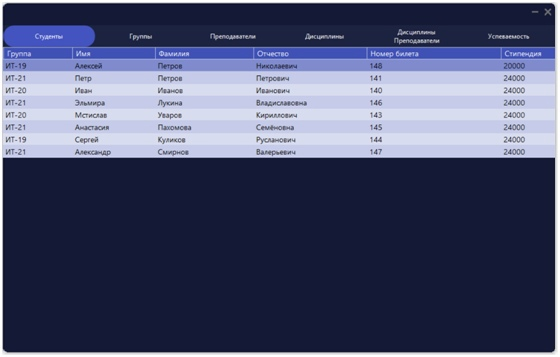

# C-and-PostgreSQL
App for work with DB

### ER сhart

  

<h1 align="center"></h1>

### Work Demonstration
https://user-images.githubusercontent.com/87932748/161400570-060225fb-4d2a-44f5-a23a-6765d9078452.mp4

<h1 align="center"></h1>

### Login Interface

<h1 align="center"></h1>

### Admin Interface

Role Admin. Can view, update, add and delete entries.

<h1 align="center"></h1>

<h1 align="center"></h1>

### User Interface

Can only view entries

